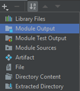

# Losing the Thread #

*Project undertaken in fulfillment of MSc Computer Science, 
Birkbeck, University of London*

## Instructions for use ##

### 1. Make a jar file of your multithreaded application in IntelliJ ###

(Basic reference: https://www.jetbrains.com/help/idea/compiling-applications.html#package_into_jar)

1. Include module output:

2. Add a MANIFEST.MF file:
   1. Click on the new jar's name at the top of the list of jar contents
   2. Navigate to the bottom of the pane where you should find 'manifest properties'
   3. Specify the application's main class in the corresponding field as a period-separated path from Source root. _To get the correct format for the class name, navigate to the file in the Project pane, right-click on it, select 'Copy Path/Reference' and then select 'Copy Reference'._

### 2. Run the agent.jar

Type the following command into the Terminal (substituting in the sample paths for the paths from Content root):

`java -javaagent:path/to/agent.jar -jar path/to/your.jar`